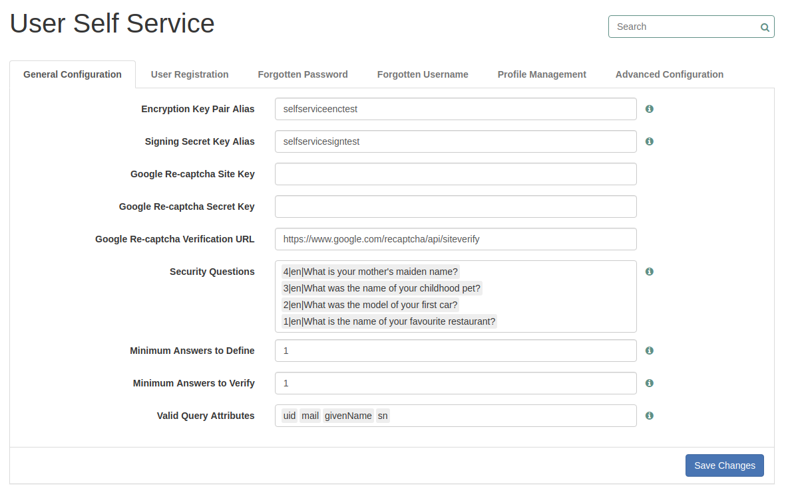
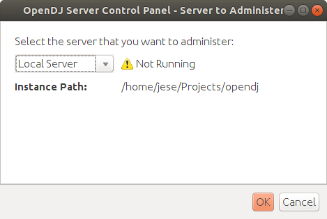

# Govcan-Ecociv

Esta variante de Consul mantiene una intrínseca conexión con 2 sistemas: **OpenAM** y éste a su vez con **OpenDJ**.

## OpenAM

**OpenAM** es un sistema de autenticación que en este caso se configura como IDP y Consul realiza su servicio como SP. 

**Nota**: Esto sólo es para el log in del usuario, el registro ataca a la API de OpenAM.

OpenAM corre en un Tomcat en el puerto **8081**.

Su dockerfile se puede encontrar en la carpeta raíz del proyecto dentro de `dockerfiles > OpenAM`.

### Login

Este se realiza mediante la gema oauth-saml que permite mantener un servicio SP. El servicio de IDP se realiza en la configuración de OpenAM.

### Registro

Consul permite registrar nuevos usuarios a través de la API REST de OpenAM, el usuario utilizará el registro normal de Consul pero este realizará
peticiones a OpenAM para registrar el nuevo usuario.

Por defecto, OpenAM mantiene deshabilitada la opción de registro. Para activarla hay que ir a `Configuración Global > Self User Service` y en la pestaña de **User Registration** activarla.

**Hay que asegurarse de tener los dos primeros campos de la pestaña de General Info iguales a la foto.**

## OpenDJ

Este realiza el servicio de almacenamiento LDAP de usuarios y configuración de OpenAM. Utiliza dos puertos: **1389 y 4444**.

El puerto **1389** es el que utiliza OpenAM para conectarse y realizar las peticiones necesarias para su configuración y almacenamiento de usuarios.

El puerto **4444** es el que se utiliza para conectarse mediante una interfaz gráfica para observar el servicio.

La imagen de Docker se puede obtener perfectamente de [openidentityplatform/opendj](https://hub.docker.com/r/openidentityplatform/opendj) y además puedes obtener más información sobre este.

Si se usa Docker no se puede utilizar la interfaz gráfica ya que se encuentra dentro de Docker, lo que se puede hacer es irse al repositorio de Github [(aquí)](https://github.com/OpenIdentityPlatform/OpenDJ/releases)
y descargarse la última versión, una vez descargada y descomprimida en la carpeta `bin` hay un fichero que se llama `control-panel`. Si lo ejecutamos veremos lo siguiente:

Configuramos el acceso y entramos al docker.

## Conexión entre OpenAM y OpenDJ

Una vez arrancado ambos sistemas si accedemos a [http://localhost:8081/openam](http://localhost:8081/openam) vemos la configuración de este.

Es muy sencilla, vamos paso por paso y como contraseñas en desarrollo he usado:

**Usuario de OpenAM (amAdmin) : 123456789**
  
**Contraseñas por defecto de OpenDJ : password**
  
**Contraseñas restantes que te pida : 12345678**

Con esto no debemos tener ningún problema de conexión.

## Variables de entorno nuevas

Se han creado nuevas variables de entorno para la conexión de Consul a OpemAM que son:

- **OPENAM_HOST**: Esta por defecto tiene el valor de `localhost:8080/openam` 
